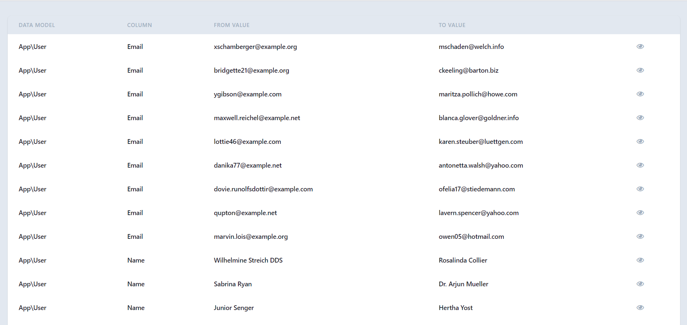
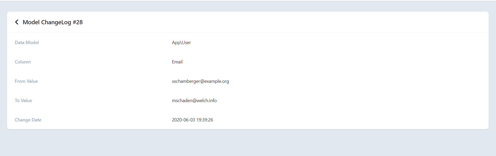

# Historiable Model

[](https://packagist.org/packages/iferas93/historiable-model)
[]()
[](https://scrutinizer-ci.com/g/iferas93/historiable-model)
[](https://packagist.org/packages/iferas93/historiable-model)

Easy way to make and show your model history
 
 
 
 


## Installation

You can install the package via composer:

```bash
composer require iferas93/historiable-model
```

## Usage
This package create "histories" table.
Publish the migration and the configuration file using
``` 
php artisan historiable:install
```


After that you can add the trait `Histroiable`  on any  model like:
```
use Iferas93\HistoriableModel\Traits\History\Histroiable;

class Artical extends Model
{
    //this line for applying historiable to Article Model
    use Historiable;

    //this function for igonred cloumns from historiable
    protected function ignoredColumns()
        {
            return [
                'updated_at',
                'slug'
            ];
        }
}
```

You can access Histories(Changelog) Table from:
``` 
http://domain.exmaple/changelog
```

### Testing

``` bash
composer test
```

### Changelog

Please see [CHANGELOG](CHANGELOG.md) for more information what has changed recently.

## Contributing

Please see [CONTRIBUTING](CONTRIBUTING.md) for details.

### Security

If you discover any security related issues, please email ferasmo7mad@gmail.com instead of using the issue tracker.

## Credits

- [Feras Mohamed](https://github.com/iferas93)
- [All Contributors](../../contributors)

## License

The MIT License (MIT). Please see [License File](LICENSE.md) for more information.
